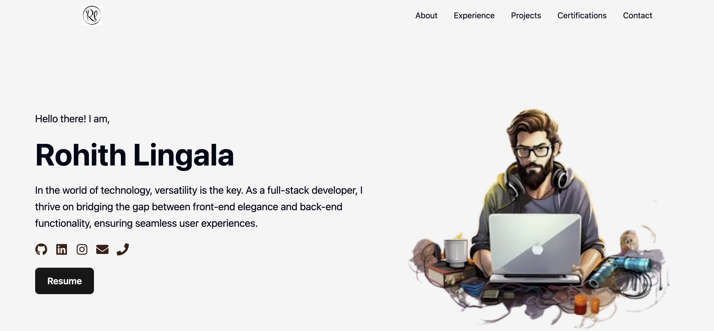

# 🚀 Rohith Lingala - Portfolio Website

Welcome to my personal portfolio website! This site showcases my skills, experience, projects, and achievements as a software developer. It's built using modern web technologies and is fully responsive across devices.

> 🟢 **Live Site**: [Visit Portfolio](https://lingalarohith.github.io/Rohith_Portfolio/)

---

## ✨ Highlights

- 🧑‍💻 **About Me** section with quick intro and goals
- 💼 Projects with GitHub and live links
- 🏆 Achievements including the **Outstanding Teaching Assistant Award (2024–2025)**
- 📫 Contact section with links to LinkedIn, GitHub, Email, and Resume
- ⚙️ Fully responsive design using React & Tailwind CSS
- 📄 Hosted via GitHub Pages

---

## 📸 Sneak Peek

 

---

## 🛠️ Tech Stack

- React.js
- Tailwind CSS
- TypeScript
- GitHub Pages (Deployment)

---

## 🚀 Getting Started

### 1. Clone the Repository

```bash
git clone https://github.com/LingalaRohith/Rohith_Portfolio.git
cd Rohith_Portfolio

npm install


npm run dev
# or
npm start
